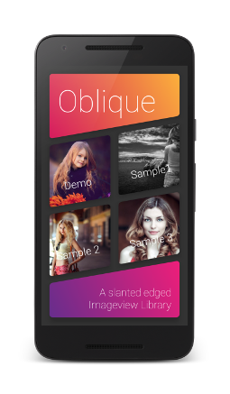
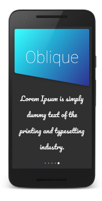
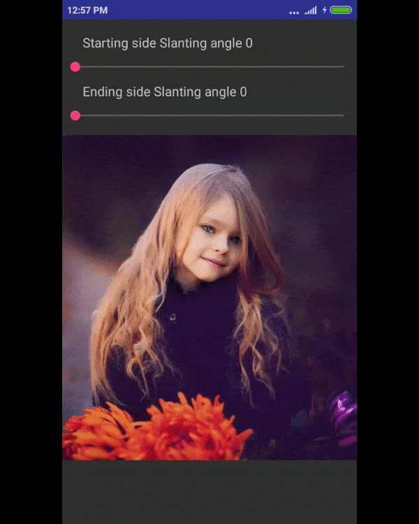

Oblique
=======

With Oblique explore new styles of displaying images

[](https://gitter.im/Oblique22/Lobby?utm_source=badge&utm_medium=badge&utm_campaign=pr-badge&utm_content=badge)
[](https://android-arsenal.com/details/1/5659)
[](https://jitpack.io/#akshay2211/Oblique)
[](https://medium.com/@fxn769/oblique-attractive-android-ui-library-ae07a87a94)
[](http://awesomeandroidlibrary.com/2018/01/31/oblique-explore-new-styles-of-displaying-images/)
[](https://android-arsenal.com/api?level=9)

[  ](https://play.google.com/store/apps/details?id=ak.sh.ay.app)

Demo
----





Usage
-----
include namespace
```groovy
        xmlns:app="http://schemas.android.com/apk/res-auto"
```

ObliqueView xml representation
```groovy
        <ak.sh.ay.oblique.ObliqueView
        android:id="@+id/obliqueView"
        android:layout_width="match_parent"
        android:layout_height="match_parent"
        android:layout_margin="20dp"
        android:scaleType="centerCrop"
        app:angle="LEFT_BOTTOM_TO_RIGHT_TOP"
        android:src="@drawable/img"
        app:basecolor="#2E3192"
        app:startcolor="#D4145A"
        app:endcolor="#FBB03B"
        app:radius="18"
        app:shadow_height="10"
        app:ending_slant_angle="0"
        app:starting_slant_angle="10"
        app:type="linear_gradient" />
```

Change your Style by changing oblique type
```groovy
         app:type="image" 
         app:type="solid_color" 
         app:type="linear_gradient" 
         app:type="radial_gradient" 

```

or can do all that by java
```groovy
        obliqueView.setType(Type.LINEAR_GRADIENT);
        obliqueView.setStartColor(Color.parseColor("#D4145A"));
        obliqueView.setEndColor(Color.parseColor("#FBB03B"));
        obliqueView.setAngle(GradientAngle.LEFT_BOTTOM_TO_RIGHT_TOP);
        obliqueView.setStartAngle(12);
        obliqueView.setEndAngle(0);
        obliqueView.setCornerRadius(15);
        obliqueView.setShadow(10);
```
set multiple types in java among these
```groovy
        obliqueView.setType(Type.LINEAR_GRADIENT);
     
        IMAGE, LINEAR_GRADIENT, RADIAL_GRADIENT, SOLID_COLOR
```
add radius and elevation by 
```groovy
        obliqueView.setCornerRadius(15);
        obliqueView.setShadow(10);
```
Download
--------

 [  ](https://bintray.com/fxn769/android_projects/Oblique/_latestVersion)  or grab via Gradle:
```groovy
        implementation  'com.fxn769:oblique:2.0'
```
or Maven:
```xml
        <dependency>
          <groupId>com.fxn769</groupId>
          <artifactId>oblique</artifactId>
          <version>2.0</version>
          <type>pom</type>
        </dependency>
```
or ivy:
```xml
        <dependency org='com.fxn769' name='oblique' rev='2.0'>
          <artifact name='oblique' ext='pom' ></artifact>
        </dependency>
```

Snapshots of the development version are available in [Sonatype's `snapshots` repository][snap].


## License
Licensed under the Apache License, Version 2.0, [click here for the full license](/LICENSE.txt).

## Author & support
This project was created by [Akshay Sharma](https://akshay2211.github.io/).

> If you appreciate my work, consider buying me a cup of :coffee: to keep me recharged :metal: by [PayPal](https://www.paypal.me/akshay2211)

> I love using my work and I'm available for contract work. Freelancing helps to maintain and keep [my open source projects](https://github.com/akshay2211/) up to date!

[](http://forthebadge.com)


 [1]: https://play.google.com/store/apps/details?id=ak.sh.ay.app
 [2]: https://dl.bintray.com/fxn769/android_projects/com/fxn769/oblique/1.0/oblique-1.0-sources.jar
 [snap]: https://oss.sonatype.org/content/repositories/snapshots/
