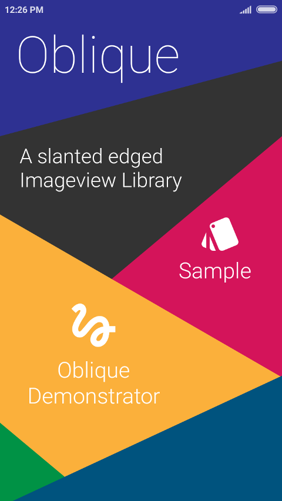
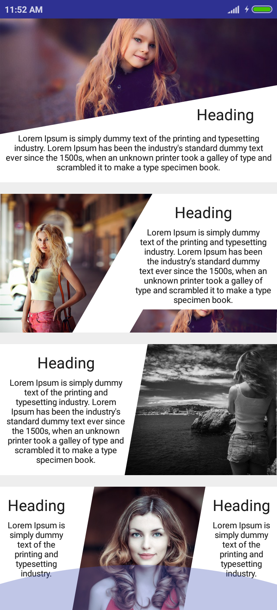

Oblique
=======

A Slanted Edged ImageView library for Android




Usage
-----

```xml
 <ak.sh.ay.oblique.ObliqueView
        android:id="@+id/obliqueView"
        android:layout_width="match_parent"
        android:layout_height="160dp"
        android:layout_weight="0.26"
        android:scaleType="centerCrop"
        android:src="@drawable/img"
        app:ending_slant_angle="20"
        app:starting_slant_angle="20" />
```
you can also add solid color by adding

```xml
 app:basecolor="#D4145A"
```

or can do all that by java
```groovy
obliqueView.setStartAngle(20);
obliqueView.setEndAngle(20);
```
set image or add solid color
```java
 obliqueView.setBaseColor(R.color.colorAccent);
```

Download
--------

Download [the latest JAR][2] or grab via Gradle:
```groovy
compile 'com.fxn769:oblique:1.0'
```
or Maven:
```xml
<dependency>
  <groupId>com.fxn769</groupId>
  <artifactId>oblique</artifactId>
  <version>1.0</version>
  <type>pom</type>
</dependency>
```
or ivy:
```xml
<dependency org='com.fxn769' name='oblique' rev='1.0'>
  <artifact name='oblique' ext='pom' ></artifact>
</dependency>
```

Snapshots of the development version are available in [Sonatype's `snapshots` repository][snap].


License
--------

    Copyright 2017 Akshay Sharma

    Licensed under the Apache License, Version 2.0 (the "License");
    you may not use this file except in compliance with the License.
    You may obtain a copy of the License at

       http://www.apache.org/licenses/LICENSE-2.0

    Unless required by applicable law or agreed to in writing, software
    distributed under the License is distributed on an "AS IS" BASIS,
    WITHOUT WARRANTIES OR CONDITIONS OF ANY KIND, either express or implied.
    See the License for the specific language governing permissions and
    limitations under the License.


 [2]: https://dl.bintray.com/fxn769/android_projects/com/fxn769/oblique/1.0/oblique-1.0-javadoc.jar
 [snap]: https://oss.sonatype.org/content/repositories/snapshots/